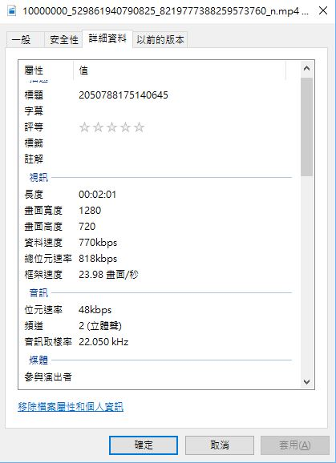
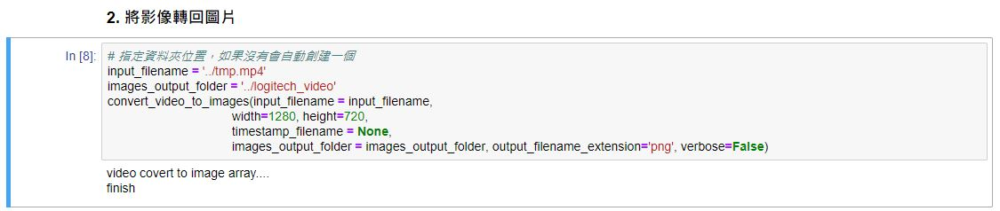
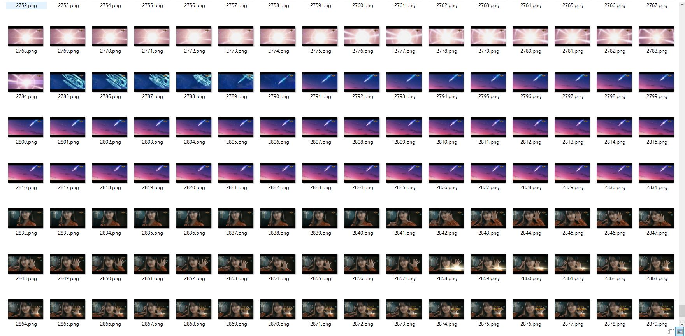

# Video_Image_Converter
A simple implement to convert video into frame images, and you can also convert images into video(Use ffmpeg).

## WHEN TO USE
### 1. Compress data size 
for example, today I have huge sizes of lots frame images, I have to send those data to my machine learning server(can train with GPU). One approach is convert those image into video in order to compress data size, and after pass video to server, I can unconvert video to frame images.

I have tried convert images(~1G) to video, which successful compressed about ~20MB

### 2.Get continuous image from video
and then you will have lots of data for machine learning.:)

### 3.Hmmm...
I have no idea now:|

## How to Start
Open my code throught jupyter, and just run.
just two function, and you have to replace file path and modify parameter(if need):
- ```convert_images_to_video()```
- ```convert_video_to_images()```

I do my best to write detailed comment, for more detail please look my code.

## Demo
use **convert a video into frame images** as a demo, you have to assign video path, output folder path and width and height of images(must same as video shape).

To see shape info of Video, In Windows you can get from here



When it run finish, you can see lots of frame images in your output folder:)



and run ```convert_video_to_images``` code to convert a video into frame images



## Use Language & Packages
- python-ffmpeg
- cv2
- os
- glob

## Environment
for some reason, **python-ffmpeg seems dont work well on Windows**, I have no idea why...but due to this reason those code just work well for
- MacOS
- Linux
